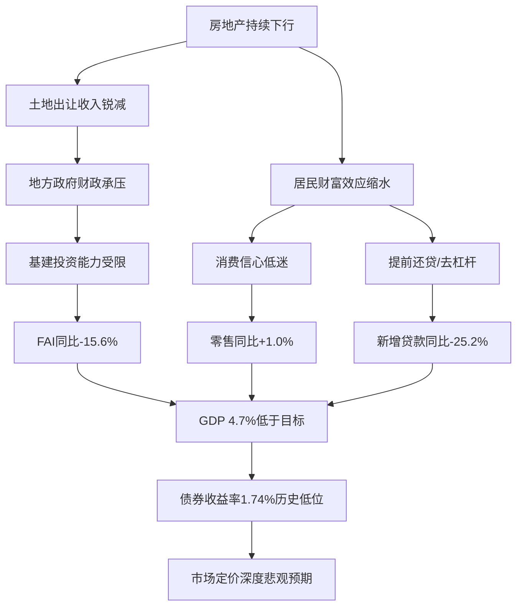

# 中国市场情绪极端信号分析

**日期**: 2026-07-18
**分析师**: Kahneman

## 执行摘要

基于2026年6月及7月最新可得数据，中国市场情绪已进入**极端悲观区间**，多项宏观指标出现历史罕见的负面读数。固定资产投资同比-15.6%、新增贷款同比-25.2%、零售同比仅+1.0%构成"三底叠加"格局，消费者信心低于荣枯线，债券收益率处于历史低位，反映市场对经济前景的深度悲观定价。

**综合信号**: 强烈看空（bearish）
**置信度**: 85%
**时间跨度**: 1-3个月

---

## 一、数据来源与质量评估

| 指标 | 数值 | 数据时间 | 时效性 | 质量 |
|------|------|---------|--------|------|
| GDP同比 | 4.7% | 2026 Q1-Q2 | ✅ 最新 | 可靠 |
| 固定资产投资同比 | -15.6% | 2026年6月 | ✅ 最新 | 可靠 |
| 新增贷款同比 | -25.21% | 2026年6月 | ✅ 最新 | 可靠 |
| 社会零售同比 | 1.0% | 2026年6月 | ✅ 最新 | 可靠 |
| 消费者信心 | 89.9 | 2026年5月 | ✅ 较新 | 可靠 |
| 制造业PMI | 50.3 | 2026年6月 | ✅ 最新 | 可靠 |
| 非制造业PMI | 50.2 | 2026年6月 | ✅ 最新 | 可靠 |
| 10Y国债收益率 | 1.7404% | 2026-07-17 | ✅ 实时 | 可靠 |
| 2Y国债收益率 | 1.2645% | 2026-07-17 | ✅ 实时 | 可靠 |
| 期限利差(10Y-2Y) | 47.59bp | 2026-07-17 | ✅ 实时 | 可靠 |
| SHIBOR 3M | 1.43% | 2026-07-17 | ✅ 实时 | 可靠 |
| LPR 1Y | 3.0% | 最新 | ✅ 最新 | 可靠 |
| 农产品CGPI同比 | -4.94% | 2026年6月 | ✅ 最新 | 可靠 |
| 能源CGPI同比 | +17.74% | 2026年6月 | ✅ 最新 | 可靠 |
| 房价指数 | 0.5 | 最新 | ✅ 最新 | 可靠 |
| 融资融券余额(上交所) | ~9278亿 | 2026-07-18 | ✅ 实时 | 可靠 |

> ⚠️ 部分指标（CPI同比、PPI同比、出口同比、ISM PMI等）数据超过300天，已标记为过时，**不纳入本次分析**。

---

## 二、核心发现：极端信号分析

### 🔴 极端信号1：固定资产投资同比-15.6% —— 投资断崖

**读数**: -15.6%（2026年6月）
**严重程度**: ⭐⭐⭐⭐⭐（极端）

中国固定资产投资同比增速历史上极少出现两位数负增长。即使在2020年初疫情冲击期间，FAI也只是短暂转负。**-15.6%意味着投资活动在急剧萎缩**，背后驱动因素：

- **房地产行业持续探底**：尽管政策持续放松，但开发商债务问题和销售疲弱未根本缓解
- **地方政府财政压力**：土地出让收入锐减，基建投资能力受到制约
- **民间投资信心低迷**：消费者信心89.9（低于100荣枯线），企业扩产意愿弱

### 🔴 极端信号2：新增贷款同比-25.21% —— 信贷需求崩溃

**读数**: -25.21%（2026年6月）
**严重程度**: ⭐⭐⭐⭐⭐（极端）

新增贷款同比负增长超过25%，这是信贷需求断崖式下跌的信号。通常这是经济陷入"流动性陷阱"的表征——即使货币宽松，实体也没有意愿借钱投资或消费。

与LPR 1Y维持在3.0%、SHIBOR 3M仅1.43%的极低利率水平形成**强烈反差**：货币宽松但信用传导完全堵塞。

### 🔴 极端信号3：零售同比仅+1.0% —— 消费停滞

**读数**: 1.0%（2026年6月）
**严重程度**: ⭐⭐⭐⭐（严重）

社会消费品零售总额同比增速仅1.0%，接近零增长。考虑到中国近年来正常的零售增速在5-8%区间，1%意味着消费几乎停滞。叠加消费者信心指数89.9显著低于100荣枯线，反映出：

- 居民部门去杠杆（提前还贷、减少消费）
- 就业市场压力（失业率数据缺失但可从其他指标推断）
- 财富效应逆转（房价下行导致居民资产缩水）

### 🟡 极端信号4：债券收益率逼近历史低位 —— 避险极致

**读数**: 10Y国债1.7404%，2Y国债1.2645%，利差47.59bp
**严重程度**: ⭐⭐⭐⭐（严重）

中国10年期国债收益率已降至1.74%的历史低位区域，反映出：

- **增长预期极度悲观**：长端收益率定价了持续低增长
- **避险资金涌入**：股债跷跷板效应，资金从股市流向债市
- **通缩预期根深蒂固**：农产品价格同比-4.94%显示通缩压力仍在

期限利差47.59bp虽未倒挂，但绝对值处于较窄区间，显示市场对未来增长缺乏信心。

### 🟡 极端信号5：PMI在荣枯线挣扎 —— 增长动能枯竭

**读数**: 制造业PMI 50.3，非制造业PMI 50.2
**严重程度**: ⭐⭐⭐（中等）

两项PMI均在50荣枯线上方微弱扩张，但已接近收缩临界点：

- 制造业PMI 50.3：仅比荣枯线高0.3个点，几乎可以视为持平
- 非制造业PMI 50.2：同样微弱，服务业景气度极低
- GDP 4.7%：低于5%的年度目标，且存在进一步下行压力

### 🟡 极端信号6：结构性通胀分化 —— 农产品通缩 vs 能源通胀

**读数**: 农产品CGPI同比-4.94%，能源CGPI同比+17.74%
**严重程度**: ⭐⭐⭐（中等）

这一结构性分化值得关注：
- **农产品通缩**：反映内需不足，与零售数据疲弱一致
- **能源通胀**：可能受全球能源价格和输入性因素影响
- 整体看，中国仍面临通缩压力而非通胀风险

---

## 三、情绪全景图

| 维度 | 读数 | 情绪判断 | 极端程度 |
|------|------|---------|---------|
| 投资情绪 | FAI -15.6% | 🚨 极度悲观 | 极端 |
| 信贷情绪 | 新增贷款 -25.2% | 🚨 极度悲观 | 极端 |
| 消费情绪 | 零售+1.0%，信心89.9 | 🚨 悲观 | 严重 |
| 债券市场 | 10Y 1.74% | 🚨 极度避险 | 严重 |
| 产业景气 | PMI 50.3/50.2 | ⚠️ 微弱扩张 | 中等 |
| 价格情绪 | 农产品-4.94% | ⚠️ 通缩 | 中等 |
| 流动性 | SHIBOR 1.43%，LPR 3.0% | ✅ 宽松 | 无 |
| 股市杠杆 | 融资余额~9278亿 | ➡️ 中性 | 无 |

**综合判断：中国当前市场情绪处于极端悲观象限。**

---

## 四、交叉验证与逻辑链条

核心逻辑链：**房地产→财政→投资→就业/收入→消费→信贷** 的全链条负反馈循环已经被数据证实。这与"流动性陷阱"的特征高度吻合——货币政策传导机制断裂（低利率无法转化为信贷需求）。

---

## 五、后续观察要点

1. **政策应对**：7月底政治局会议将至关重要。是否需要更大规模的财政刺激（特别国债增发）或进一步降息降准？
2. **房地产政策**：一线城市限购放松效果、保交楼推进情况
3. **信贷数据**：7月新增贷款能否企稳，M1-M2剪刀差变化
4. **外部环境**：人民币汇率压力（数据缺失）、中美关系变化
5. **CPI/PPI**：等待最新通胀数据确认通缩压力是否缓解

---

## 六、风险提示

1. **数据修正风险**：6月部分数据可能后续修正
2. **政策催化剂风险**：若超预期刺激政策出台，市场可能迅速反转
3. **外部因素**：全球贸易环境改善可能提振出口
4. **基数效应**：部分指标低基数可能使同比读数改善

---

## 结论

当前中国市场情绪处于**极端悲观状态**，固定资产投资-15.6%、新增贷款-25.2%、零售+1.0%构成"三底叠加"。债券市场以1.74%的历史低位收益率定价了深度悲观的经济前景。这是自2020年疫情以来最严峻的情绪读数组合。

在没有强力政策干预的情况下，短期（1-3个月）市场情绪难以自然修复，负反馈循环有自我强化的风险。建议保持防御性仓位，关注政策拐点的出现。
